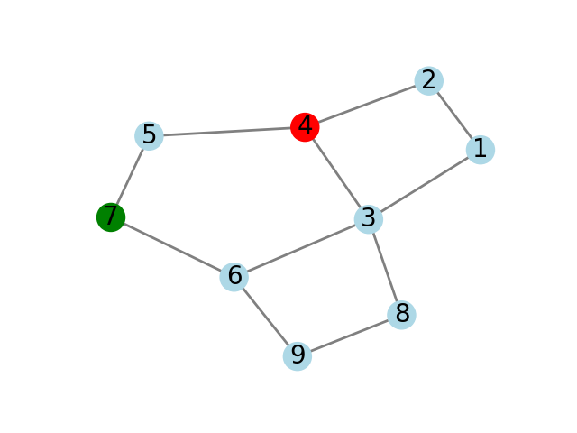
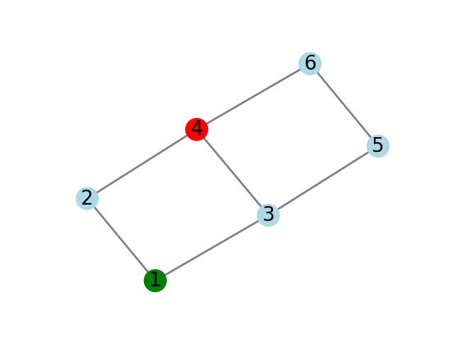
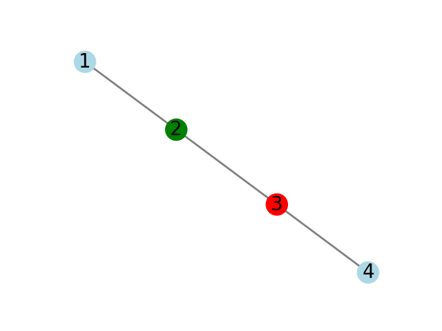

# DSR Simulation

Dynamic Source Routing is a routing protocol used in wireless ad hoc networks. The DSR protocol is designed to find and maintain routes between nodes in a wireless network, without the need for a centralized routing infrastructure.

In DSR, when a source node wants to send a packet to a destination node, it first searches its route cache for a route to the destination. If a route is not found, the source node initiates a route discovery process. During route discovery, the source node broadcasts a route request packet, which is received by its neighbors. Each neighbor forwards the packet to its neighbors, until the packet reaches the destination or a node that has a route to the destination in its cache. The route discovery process creates a route from the source to the destination, which is added to the route cache of all nodes along the path. Once a route has been established, packets can be sent between the source and destination using the discovered route.

Here, we will simulate the DSR route discovery process.

## Problem Description

Given a graph of n vertices and m edges. Each node has no prior knowledge of the network topology.

Then two vertices are given, our task is to initiate the route discovery process from the source to the destination. Each vertex should broadcast the RREQ to the neighboring vertices. Output the path forwarded in the RREQ.

### Input Format

The first line consists of two integers `n` and `m`: the number of vertices and the number of edges.

Each of the following m lines contains a pair of integers `x` and `y`, that show that an edge exists between vertices `x` and `y`. For each pair of vertices there will be at most one edge between them, no edge connects a vertex to itself.

The next line contains a pair of integers `u` and `v`, asking about the route between them.

**Constraints**

- 2 ≤ `n` ≤ 1000
- 1 ≤ `m` ≤ `(n.(n-1))` / 2
- 1 ≤ `x`, `y` ≤ `n`, `x` ≠ `y`
- 1 ≤ `u`, `v` ≤ `n`, `u` ≠ `v`

### Output Format

Output n lines. The i th line represents path forwarded in `RREQ` for vertex `i` where (1 ≤ `i` ≤ `n`).

If there are multiple possible paths, output the shortest one having the lexicographically smallest path. If a vertex won't forward a `RREQ`, output `-1`.

<!-- create a table with three columns -->
## Test Scenarios

| Sample Input 	| Sample Output 	| Graph 	|
|---	|---	|---	|
| 9 11<br>1 2<br>1 3<br>2 4<br>3 4<br>3 6<br>3 8<br>4 5<br>5 7<br>6 7<br>6 9<br>8 9<br>8 4 	| 8 3 1 <br>8 3 1 2 <br>8 3 <br>-1<br>8 3 6 7 5 <br>8 3 6 <br>8 3 6 7 <br>8 <br>8 9 	|  	|
| 6 7<br>1 2<br>1 3<br>2 4<br>3 4<br>3 5<br>4 6<br>5 6<br>1 4 	| 1 <br>1 2 <br>1 3 <br>-1<br>1 3 5 <br>1 3 5 6 	|  	|
| 4 3<br>1 2<br>2 3<br>3 4<br>2 3 	| 2 1 <br>2 <br>-1<br>-1 	|  	|

## Running the tests
>> You can find the code [here](DSR.py) and the tests in `tests` directory.

Run: `python3 ./DSR.py ` in the root directory of the project.

Output:
``` bash
> python3 ./DSR.py 
TEST CASE 1 test1.txt
Source: 8, Destination: 4
8 3 1 (CORRECT)
8 3 1 2 (CORRECT)
8 3 (CORRECT)
-1 (CORRECT)
8 3 6 7 5 (CORRECT)
8 3 6 (CORRECT)
8 3 6 7 (CORRECT)
8 (CORRECT)
8 9 (CORRECT)
-----------------------------------
TEST CASE 2 test2.txt
Source: 1, Destination: 4
1 (CORRECT)
1 2 (CORRECT)
1 3 (CORRECT)
-1 (CORRECT)
1 3 5 (CORRECT)
1 3 5 6 (CORRECT)
-----------------------------------
TEST CASE 3 test3.txt
Source: 2, Destination: 3
2 1 (CORRECT)
2 (CORRECT)
-1 (CORRECT)
-1 (CORRECT)
-----------------------------------
```
